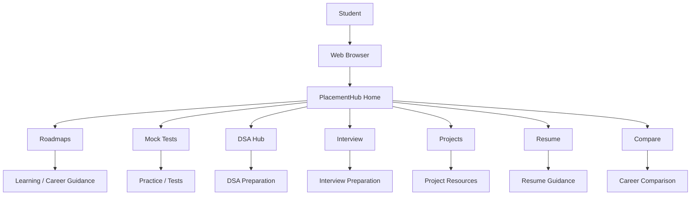
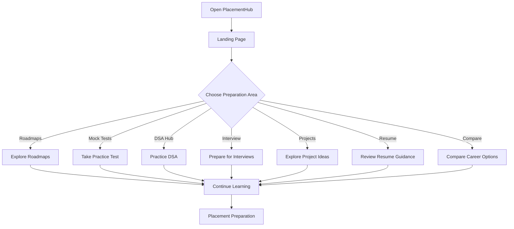
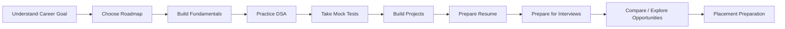
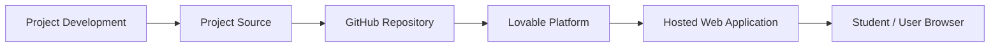
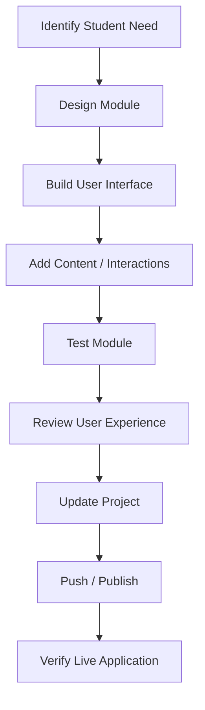

# 🚀 PlacementHub

### Complete Placement Preparation Platform for Students

PlacementHub is a web-based placement preparation platform designed to bring career roadmaps, mock tests, DSA practice, interview preparation, project ideas, resume guidance, and career comparison resources together in one place.

The platform is designed with a student-focused interface that helps learners explore different preparation areas without requiring a separate platform for every stage of placement preparation.

---

## 🌐 Live Demo

🔗 **Live Application:**  
https://amiable-site-creation.lovable.app/

---

## 📌 Overview

Preparing for placements often requires students to use multiple resources for aptitude, DSA, interviews, projects, resumes, and career research.

**PlacementHub** brings these preparation areas together through a centralized web interface.

The platform provides access to:

- Career roadmaps
- Mock tests
- DSA practice
- Interview preparation
- Project ideas
- Resume guidance
- Career comparison
- Learning resources

The objective is to provide students with a simple and organized starting point for their placement preparation journey.

---

# 🎯 Problem Statement

Students preparing for placements commonly need to switch between different websites, notes, coding platforms, interview resources, project references, and resume resources.

This creates problems such as:

- Difficulty organizing preparation resources
- Lack of a structured preparation path
- Separate resources for different placement stages
- Difficulty deciding what to learn next
- Limited visibility into career preparation options
- Difficulty comparing different career paths

PlacementHub addresses these challenges by organizing multiple placement-preparation modules within one platform.

---

# 💡 Solution

PlacementHub acts as a centralized student-focused preparation hub.

```text
                    STUDENT
                       │
                       ▼
                ┌───────────────┐
                │ PlacementHub  │
                └───────┬───────┘
                        │
       ┌────────────────┼─────────────────┐
       │                │                 │
       ▼                ▼                 ▼
   Roadmaps         Mock Tests         DSA Hub
       │                │                 │
       └────────────────┼─────────────────┘
                        │
       ┌────────────────┼─────────────────┐
       │                │                 │
       ▼                ▼                 ▼
   Interview        Projects           Resume
       │                │                 │
       └────────────────┼─────────────────┘
                        │
                        ▼
                   Compare
                        │
                        ▼
               Career Preparation
```

---

# ✨ Key Features

## 🗺️ Career Roadmaps

The Roadmaps section helps students understand structured learning and career-preparation paths.

It can serve as a starting point for students who are unsure about:

- What to learn
- Which skills to prioritize
- How to organize preparation
- Which direction to explore

---

## 📝 Mock Tests

The Mock Tests section provides a dedicated area for practice.

It is intended to help students prepare through:

- Practice questions
- Test-oriented preparation
- Placement-style learning
- Self-assessment

---

## 💻 DSA Hub

The DSA Hub focuses on Data Structures and Algorithms preparation.

It provides a dedicated space for students interested in improving their coding and problem-solving preparation.

Potential preparation areas include:

- Data structures
- Algorithms
- Problem solving
- Coding practice

---

## 🎤 Interview Preparation

The Interview section provides interview-oriented preparation resources.

It helps students prepare for different stages of the recruitment process by organizing interview-related material in one location.

---

## 🚀 Project Ideas

The Projects section provides project-oriented resources for students.

Projects can help students:

- Build practical experience
- Improve development skills
- Create portfolio material
- Discuss technical work during interviews

---

## 📄 Resume Guidance

The Resume section provides resources related to preparing and improving a student's resume.

The purpose is to help students understand how to present:

- Skills
- Projects
- Experience
- Education
- Achievements

in a professional format.

---

## ⚖️ Career Comparison

The Compare section is designed to help students compare career or preparation options.

This can support students when deciding between different learning directions and career paths.

---

## 🎯 Start Learning

The landing page provides a clear **Start Learning** call-to-action to guide students into the platform.

The home page also provides direct actions for:

- Exploring roadmaps
- Taking a mock test

---

# 🧭 Platform Modules

```text
┌──────────────────────────────────────────────────────┐
│                    PlacementHub                      │
├──────────────────────────────────────────────────────┤
│                                                      │
│  🗺️ Roadmaps       → Structured preparation paths    │
│  📝 Mock Tests     → Practice and assessment         │
│  💻 DSA Hub        → Coding & problem solving        │
│  🎤 Interview      → Interview preparation           │
│  🚀 Projects       → Project ideas                   │
│  📄 Resume         → Resume guidance                 │
│  ⚖️ Compare        → Career comparison               │
│                                                      │
└──────────────────────────────────────────────────────┘
```

---

# 🏗️ High-Level Architecture

PlacementHub is a web-based student-facing application.

The currently documented implementation is presented as a frontend web experience deployed through the Lovable platform.



> The architecture above represents the currently visible application structure. Backend services, databases, APIs, or external authentication are not claimed unless implemented and verified in the repository.

---

# 🔄 User Journey



---

# 📚 Placement Preparation Workflow



---

# 🧠 Learning Flow

```text
                ┌────────────────────┐
                │  Career Direction  │
                └─────────┬──────────┘
                          │
                          ▼
                ┌────────────────────┐
                │      Roadmap       │
                └─────────┬──────────┘
                          │
                          ▼
                ┌────────────────────┐
                │    Fundamentals    │
                └─────────┬──────────┘
                          │
                          ▼
                ┌────────────────────┐
                │       DSA          │
                └─────────┬──────────┘
                          │
                          ▼
                ┌────────────────────┐
                │    Mock Tests      │
                └─────────┬──────────┘
                          │
                          ▼
                ┌────────────────────┐
                │      Projects      │
                └─────────┬──────────┘
                          │
                          ▼
                ┌────────────────────┐
                │      Resume        │
                └─────────┬──────────┘
                          │
                          ▼
                ┌────────────────────┐
                │     Interview      │
                └─────────┬──────────┘
                          │
                          ▼
                ┌────────────────────┐
                │ Placement Ready    │
                └────────────────────┘
```

---

# 🎨 User Interface

PlacementHub uses a modern student-focused interface with:

- Dark navigation bar
- Gradient visual design
- Large landing-page hero section
- Clear call-to-action buttons
- Module-based navigation
- Responsive card and content layout
- Theme toggle
- Student-oriented information architecture

---

# 🖥️ Landing Page

The landing page communicates the platform's primary purpose:

> A complete placement preparation journey in one place.

The home page highlights:

- Roadmaps
- Mock Tests
- DSA practice
- Interview preparation
- Project ideas
- Resume guidance
- Career comparison

It also provides:

- **Explore Roadmaps**
- **Take a Mock Test**
- **Start Learning**

---

# 🗂️ Project Structure

The repository currently contains a `PlacementHub` project directory along with a project description and README.

A simplified representation is:

```text
PlacementHub/
│
├── PlacementHub/
│   └── [Application Source]
│
├── Description
│
└── README.md
```

> The exact internal structure should be updated if the project source is reorganized in the future.

---

# 🛠️ Technology Stack

Based on the project information provided for PlacementHub:

### Frontend

- HTML
- CSS
- JavaScript

### Platform / Development

- Lovable
- GitHub

### Deployment

- Lovable hosted deployment

The project is currently accessible through its deployed Lovable application.

---

# 🔗 Application Navigation

```text
PlacementHub
│
├── Roadmaps
├── Mock Tests
├── DSA Hub
├── Interview
├── Projects
├── Resume
└── Compare
```

This navigation structure keeps major placement-preparation resources accessible from the primary interface.

---

# 🚀 Deployment Architecture



### Live Application

🔗 https://amiable-site-creation.lovable.app/

---

# 💻 Development Workflow



---

# 🧪 Testing Checklist

Before publishing updates, verify:

- [ ] Landing page loads correctly
- [ ] Navigation works
- [ ] Roadmaps section works
- [ ] Mock Tests section works
- [ ] DSA Hub works
- [ ] Interview section works
- [ ] Projects section works
- [ ] Resume section works
- [ ] Compare section works
- [ ] Theme toggle works
- [ ] CTA buttons work
- [ ] Responsive layout works
- [ ] Live deployment works

---

# 📸 Screenshots

## 🏠 Landing Page

Add the main PlacementHub landing-page screenshot here.

```text
docs/screenshots/home.png
```

## 🗺️ Roadmaps

Add a screenshot of the Roadmaps section here.

```text
docs/screenshots/roadmaps.png
```

## 📝 Mock Tests

Add a screenshot of the Mock Tests section here.

```text
docs/screenshots/mock-tests.png
```

## 💻 DSA Hub

Add a screenshot of the DSA Hub here.

```text
docs/screenshots/dsa-hub.png
```

## 🎤 Interview

Add a screenshot of the Interview section here.

```text
docs/screenshots/interview.png
```

## 🚀 Projects

Add a screenshot of the Projects section here.

```text
docs/screenshots/projects.png
```

## 📄 Resume

Add a screenshot of the Resume section here.

```text
docs/screenshots/resume.png
```

## ⚖️ Compare

Add a screenshot of the Compare section here.

```text
docs/screenshots/compare.png
```

---

# 📈 Project Value

PlacementHub demonstrates practical experience with:

- Student-focused product design
- Frontend web development
- Information architecture
- Responsive UI design
- Interactive navigation
- Learning-platform design
- Career-preparation workflows
- Web deployment

---

# 🔮 Future Enhancements

Potential future enhancements include:

### 🔐 User Accounts

- Student registration
- Login
- Personalized profiles
- Progress tracking

### 📊 Progress Dashboard

```text
Student
   │
   ▼
Learning Activity
   │
   ├── DSA Progress
   ├── Mock Test Scores
   ├── Roadmap Completion
   ├── Interview Preparation
   └── Project Progress
             │
             ▼
       Student Dashboard
```

### 📝 Advanced Mock Tests

- Timed tests
- Question categories
- Score tracking
- Performance analytics
- Topic-wise analysis

### 💻 DSA Practice

- Problem library
- Difficulty levels
- Coding challenges
- Progress tracking
- Topic-wise practice

### 🎯 Personalized Roadmaps

- Student-selected career path
- Skill recommendations
- Learning milestones
- Progress tracking

### 📄 Resume Tools

- Resume templates
- Resume builder
- Resume checklist
- Section-wise guidance

### 🤖 AI-Assisted Features

Potential future features could include:

- AI resume feedback
- AI interview practice
- Personalized learning recommendations
- Question generation
- Career guidance assistant

> These are proposed future enhancements and are not claims about the current implementation.

---

# 🌱 Learning Outcomes

Building PlacementHub provides practical exposure to:

- Frontend development
- HTML and CSS
- JavaScript
- Responsive web design
- UI/UX principles
- Component-based information organization
- Student-product design
- Deployment workflows
- GitHub project management
- Web application presentation

---

# 🏆 Project Highlights

### 🎓 Student-Centered Platform

Designed around common placement-preparation requirements.

### 🧭 Structured Preparation

Brings roadmaps, DSA, mock tests, interviews, projects, and resume guidance into one platform.

### 💻 Practical Web Application

Demonstrates a complete student-oriented web interface rather than an isolated UI component.

### 🎨 Modern Interface

Uses a modern visual design with clear navigation, gradients, responsive sections, and strong calls to action.

### 🚀 Deployed Application

The project is publicly accessible through a live Lovable deployment.

---

# 🔗 Project Links

| Resource | Link |
|---|---|
| 🌐 Live Demo | https://amiable-site-creation.lovable.app/ |
| 💻 GitHub | https://github.com/Sreehitha24/PlacementHub |
| 👩‍💻 GitHub Profile | https://github.com/Sreehitha24 |
| 🔗 LinkedIn | https://www.linkedin.com/in/keerthipati-sreehitha/ |

---

# 👩‍💻 Author

## Keerthipati Sreehitha

Computer Science & Data Science Student  
KKR & KSR Institute of Technology and Sciences

### Interests

- Software Development
- Web Development
- Artificial Intelligence
- Cloud Computing
- Problem Solving

---

## 🌐 Connect

[](https://github.com/Sreehitha24)

[](https://www.linkedin.com/in/keerthipati-sreehitha/)

---

# ⭐ Project Summary

**PlacementHub** is a centralized placement-preparation platform that brings career roadmaps, mock tests, DSA practice, interview preparation, project ideas, resume guidance, and career comparison resources into one student-focused web application.

The project demonstrates practical frontend development, student-oriented product design, structured information architecture, and web deployment.

---

⭐ If you find PlacementHub useful, explore the live application and repository.
