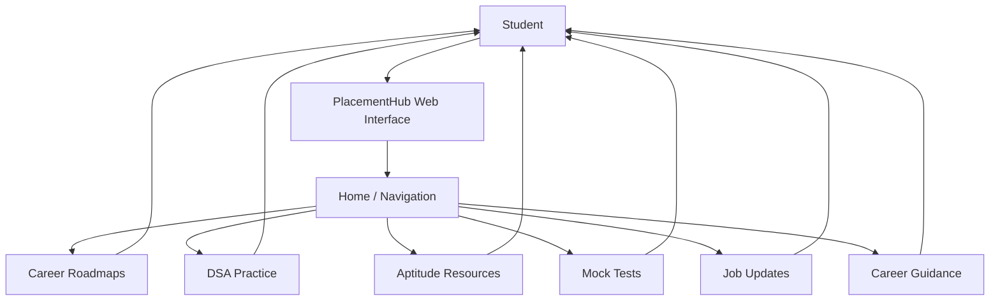
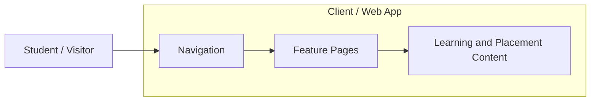
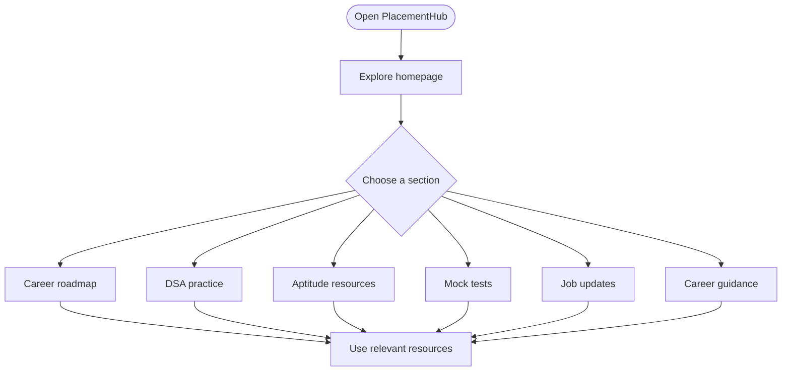

# PlacementHub

> A placement-preparation platform for students, bringing together career roadmaps, coding practice, aptitude resources, mock tests, job updates, and career guidance.

**Live Demo:** https://amiable-site-creation.lovable.app/  
**Repository:** https://github.com/Sreehitha24/PlacementHub

---

## Table of Contents

- [About](#about)
- [Features](#features)
- [Screenshots](#screenshots)
- [Architecture](#architecture)
- [User Flow](#user-flow)
- [Getting Started](#getting-started)
- [Project Structure](#project-structure)
- [Technology Stack](#technology-stack)
- [Testing Checklist](#testing-checklist)
- [Future Improvements](#future-improvements)
- [Contributing](#contributing)
- [Author](#author)

## About

PlacementHub is designed to help students organize their placement preparation in one place. It provides a central starting point for exploring learning resources, practicing coding and aptitude, preparing with mock tests, and finding career guidance.

## Features

- **Career roadmaps:** Structured learning paths for placement-related skills.
- **DSA practice:** A dedicated area for coding-practice resources.
- **Aptitude preparation:** Resources to practice placement aptitude.
- **Mock tests:** Practice-oriented preparation for assessments.
- **Job updates:** A place to find placement and job-related updates.
- **Career guidance:** Helpful direction for students preparing for opportunities.

> Feature note: This README describes the project at a high level. Update this list if a feature is not currently available or behaves differently in the deployed version.

## Screenshots

Add screenshots of the deployed application here. Keep images in a repository folder such as `docs/images/` and use relative links.

```md


```

## Architecture

The exact implementation architecture depends on the source code and services configured for the project. The diagram below is a **high-level logical view** of the user-facing platform, not a claim about specific frameworks, APIs, or databases.



### Conceptual component view



This conceptual view intentionally does not show a backend, database, authentication, or external API because those details must be confirmed from the actual implementation.

## User Flow



## Getting Started

### Use the live application

Visit: https://amiable-site-creation.lovable.app/

### Run locally

The source code and package manager are not documented in this README yet. After confirming the repository's actual framework and scripts:

1. Clone the repository.
2. Install dependencies using the package manager specified by the project.
3. Run the development command defined in `package.json` or the project's equivalent.
4. Open the local URL printed by the development server.

Example commands for a typical Git repository (adjust the project folder and commands to match the actual source):

```bash
git clone https://github.com/Sreehitha24/PlacementHub.git
cd PlacementHub
```

## Project Structure

The source structure should be documented after reviewing the actual code. A suggested organization (not a description of the current repository) is:

```text
PlacementHub/
├── public/              # Static assets
├── src/
│   ├── components/      # Reusable UI components
│   ├── pages/           # Feature pages
│   ├── assets/           # Images and other assets
│   └── ...
├── docs/
│   └── images/           # README screenshots
├── README.md
└── package.json          # If used by the project
```

## Technology Stack

Add only technologies that are confirmed in the source code. Suggested categories:

- Frontend:
- Styling:
- Backend / API (if any):
- Database (if any):
- Hosting / deployment:

**Deployment:** The project currently has a live demo hosted at the URL above. Confirm the hosting provider and deployment workflow before documenting them as technical implementation details.

## Testing Checklist

Use this checklist when validating the deployed app and after code changes:

- [ ] Homepage loads without errors.
- [ ] Navigation links open the intended sections.
- [ ] Roadmap resources open correctly.
- [ ] DSA practice links or problem pages work.
- [ ] Aptitude resources are accessible.
- [ ] Mock-test flow works from start to finish.
- [ ] Job update links are current and valid.
- [ ] Layout is usable on mobile and desktop.
- [ ] No broken images or dead links.
- [ ] Keyboard navigation and visible focus states work.

## Future Improvements

Potential enhancements to consider, depending on the project's goals:

- Add search and filters for learning resources.
- Add progress tracking for roadmaps and practice.
- Add bookmarking for useful resources.
- Improve accessibility and mobile usability.
- Add a student dashboard if user accounts are part of the planned scope.

## Contributing

Suggestions and improvements are welcome. For substantial changes, open an issue first to discuss the proposed update.

## Author

**Sreehitha Keerthipati**  
- GitHub: [Sreehitha24](https://github.com/Sreehitha24)
- LinkedIn: [keerthipati-sreehitha](https://www.linkedin.com/in/keerthipati-sreehitha/)
- Email: [sreehithak625@gmail.com](mailto:sreehithak625@gmail.com)
